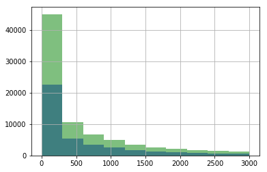

# Projeto de Big Data e Map Reduce: Analisando dados do metrô de NY - [Udacity](https://www.udacity.com/)

##  O projeto
Neste projeto, foi analisado os dados do metrô de NY e descoberto se mais pessoas andam de metrô quando está chovendo, comparado com quando não está.

Foram confrontados os dados do metrô de Nova York, usado métodos estatísticos e dados de visualização para tirar uma conclusão interessante sobre o metrô usando o conjunto de dados público.

### Coleta dos dados
Utilizando `urllib` e `BeautifulSoup`, foram baixados os dados da [MTA](http://web.mta.info/developers/turnstile.html) referentes ao mês de junho de 2017, para depois serem filtrados e consolidados em um único arquivo chamado `master_file`.

Com os dados já baixados, estes foram lidos para um DataFrame `pandas`, na qual foram trabalhados para criar duas novas colunas, na qual apresentam a diferença de entrada e saída nas catradas em comparação do registro de cima.

### Análise dos dados
Um novo conjunto de dados com informações referente ao clima foram disponibilizadas pela Udacity através de um [link](https://s3.amazonaws.com/content.udacity-data.com/courses/ud359/turnstile_data_master_with_weather.csv), esse por sua vez foi baixado e lido para resolver os exercícios e analisar a distribuição dos dados.

Plotado um histograma com as entradas por hora nos dados do metrô de Nova York com chuva e sem chuva, para analisar e comparar graficamente as distribuições dos dados:<br/>
 <br/>
As distribuições possuem basicamente a mesma forma, sendo assimétricas para a direita, positivamente distorcidas, com extrema concentração nos valores mais baixos. A diferença nítida é que há mais registros para dias não chuvosos em relação aos chuvosos.

Há uma média de aproximadamente 1105 entradas por hora em dias chuvosos e 1090 em dias sem chuva. Não havendo assim uma diferença significativa para afirmar que há mais entradas em dias chuvosos em comparação aos não chuvosos.

### Map Reduce
Foi utilizado o mesmo conjunto de dados dos exercícios de análise para criar uma função de mapeamente e uma de redução, gerando os arquivos `mapper_result`e `reducer_result`.

O objetivo das funções é somar as entradas por hora agrupando em suas respectivas unidades. Seus códigos podem ser vistos abaixo:
```python
import sys

def mapper():
    cols = sys.stdin.readline().split(',')                  # Lendo a primeira linha onde tem as colunas
    UNIT = cols.index('UNIT')                               # Pegando o index equivalente ao UNIT
    EXITSn_hourly = cols.index('EXITSn_hourly')             # Pegando o index equivalente ao EXITSn_hourly
    for line in sys.stdin:                                  # Laço para ler demais linhas
        if len(line.split(',')) != len(cols):               # Condição para verificar se a linha está minimamente íntegra
            continue
        values = line.split(',')                            # Separação dos valores da linha
        print(values[UNIT], '\t', values[EXITSn_hourly])    # Saída do mapeamento com formato: 'UNIT    EXITSn_hourly'

sys.stdin = open('turnstile_data_master_with_weather.csv')  # Alterando a entrada padrão do sistema para o arquivo de dados
sys.stdout = open('mapper_result.txt', 'w')                 # Alterando a saída padrão do sistema para o arquivo de mapeamento
mapper()
```

```python
def reducer():
    dic = {}                                    # Dicionário vazio para juntar os valores em chaves
    for line in sys.stdin:                      # Laço para percorrer as linhas do arquivo mapeado
        values = line.split('\t')               # Separação dos valores da linha
        try:                                    # Tentar somar com o valor da chave atual
            dic[values[0]] += float(values[1])
        except:                                 # Caso não tenha um valor na chave atual, criar ele
            dic[values[0]] = float(values[1])
    for key, value in dic.items():              # Laço para imprimir o dicionário consolidado
        print(key, '\t', value)

        
sys.stdin = open('mapper_result.txt', 'r')      # Alterando a entrada padrão do sistema para o arquivo de mapeamento
sys.stdout = open('reducer_result.txt', 'w')    # Alterando a saída padrão do sistema para o arquivo de redução
reducer()
```


